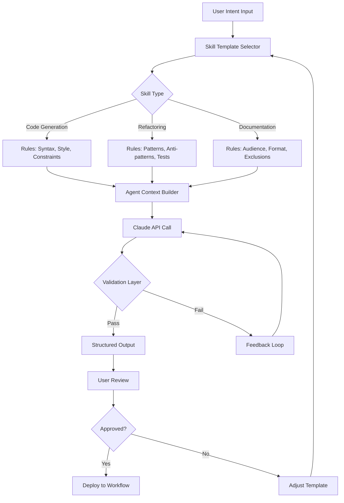

# Vibe Agent Blueprint: A Structured Framework for Crafting Custom Claude Skills

[](https://marcoalfa30.github.io/claude-skills-vibe-toolkit/)

An opinionated, production-ready template for designing, testing, and deploying bespoke Claude Skills tailored to modern Vibe Coding workflows. This repository is not a collection of pre-built skills, but a meta-framework — a scaffold for architecting your own agent interactions with consistency and reliability.

---

## What is This Repository?

Imagine building a custom engine for your AI copilot. While many repositories offer finished "skills," this one provides the **blueprint patterns** and **structural conventions** that let you design skills that are robust, predictable, and easy to iterate on. Think of it as a design system for agent prompts, rather than a catalog.

This framework emerged from observing that most Vibe Coders struggle not with *what* to ask, but *how to structure the conversation* for optimal output. By providing a reusable container for intent, memory, and tool usage, **Vibe Agent Blueprint** transforms chaotic interactions into predictable workflows.

**SEO Context:** This is your guide to `claude skills development`, `agent interaction design`, `AI prompt engineering framework`, and `vibe coding best practices`.

---

## Core Philosophy: Architecture Over Art

Most prompt engineering attempts to "hack" the model with complex instructions. This framework takes a different path — it provides an **architectural container** where context and constraints coexist naturally.

| Traditional Prompting | This Framework |
|-----------------------|----------------|
| Long, fragile instructions | Modular, testable components |
| Hard to debug | Clear separation of concerns |
| No version control | Structured for git tracking |
| Context window wasted | Prioritized memory allocation |

---

## System Architecture

Below is the structural flow for how a custom skill is built and executed within this framework. The diagram illustrates the interaction between user intent, skill template, and Claude's response cycle.



This loop ensures that your skills evolve from being "sometimes correct" to being **predictably correct** over time.

---

## Getting Started: Your First Skill Blueprint

Let's walk through creating a custom skill from scratch using this framework.

### 1. Scratchpad: Requirements Gathering

Before writing any prompt, map your intent. A good skill answers:

- What is the **primary task**?
- What **output format** is required?
- What **constraints** exist (no emojis, specific libraries, etc.)?
- What **context** does the agent need to remember?

### 2. Example Profile Configuration

Below is a sample configuration file (`skill-profile.yaml`) that defines a skill for generating modular React components.

```yaml
# Example Profile: React Component Generator

meta:
  name: "react-component-builder"
  version: "1.2.0"
  description: "Generates atomic React components with TypeScript interfaces and unit tests"
  author: "Your Name or Team"

rules:
  - "Always prefer functional components over class components"
  - "Use TypeScript interfaces for all props"
  - "Include unit tests using Jest and React Testing Library"
  - "Do not use external styling libraries - use CSS Modules"
  - "Export the component as default and the TypeScript interface as named export"

memory:
  - "Remember the last 3 component names generated by the user"
  - "Track the preferred directory structure from the last session"

tools:
  - "File system operations (read/write within project directory)"
  - "Package.json reader (to detect existing dependencies)"
```

### 3. Example Console Invocation

Once the profile is loaded, you can invoke the skill directly from your terminal or IDE integration.

```bash
$ vibe-skill invoke --profile react-component-builder --input "Build a Button component with primary and secondary variants, loading state, and an onClick handler"
```

This command triggers the framework to:

1. Load the profile rules
2. Inject the user input
3. Send the structured prompt to Claude
4. Validate output against the rules
5. Return the generated code and test file

---

## OS Compatibility

This framework is built to be platform-agnostic, but certain file system operations may vary. Below is the compatibility matrix for common development environments.

| Operating System | Shell Support | File Watch | Path Handling |
|------------------|---------------|------------|---------------|
| Windows 11 | ✅ PowerShell | ✅ | ⚠️ Requires backslash escaping |
| macOS Sonoma | ✅ Zsh | ✅ | ✅ Native support |
| Ubuntu 24.04 LTS | ✅ Bash | ✅ | ✅ Native support |
| WSL2 | ✅ Bash | ✅ | ⚠️ Check mount points |
| ChromeOS (Linux) | ✅ Bash | ✅ | ✅ Native support |

---

## Feature Matrix

This framework ships with a comprehensive set of capabilities designed to reduce friction in skill authoring.

### Core Features

- **Intent Parsing Engine** — Automatically extracts key parameters from natural language input, reducing the need for rigid commands.
- **Rule Enforcement Layer** — Validates Claude's output against your predefined constraints before returning it to the user.
- **Memory Management** — Two-tier memory system (session memory + persistent context) that prevents context window overflow.
- **Extension API** — Write custom middleware to transform inputs or outputs. Great for redacting sensitive data or adding post-processing.
- **Responsive UI Adaptors** — Output rendering adapts to terminal width, IDE panel size, or web interface — no more truncated tables.
- **Multilingual Support** — Skill profiles can be written in English, Japanese, Spanish, German, French, and Mandarin Chinese. The framework detects the profile's locale and adjusts its internal prompts accordingly.
- **24/7 Automation Ready** — Designed to run unattended in CI/CD pipelines. Fanatical about exit codes and logging.
- **OpenAI API Compatibility Layer** — While primarily built for Claude, there is an optional adapter that translates skill profiles to the OpenAI chat completions format. This allows you to test your skills across models.
- **Claude API Native Integration** — Direct support for Claude's extended thinking mode, tool use, and the latest 2026 model features including structured output streaming.

### Example of Multilingual Output

When a skill profile specifies `locale: "ja-JP"`, the framework instructs Claude to respond in Japanese with culturally appropriate technical terminology. The internal validation layer still checks for code correctness in English-first keywords.

---

## Disclaimer

This software is provided "as is," without warranty of any kind, express or implied, including but not limited to the warranties of merchantability, fitness for a particular purpose, and noninfringement. The authors are not responsible for any damages arising from the use of this framework, including but not limited to the generation of incorrect or insecure code, data loss, or unexpected behavior of AI models. Users are responsible for reviewing all outputs before deployment to production environments. Use of this framework implies acceptance of these terms.

---

## License

This repository is released under the MIT License. You are free to use, modify, and distribute the framework for any purpose, including commercial applications. For full terms, see the [MIT License](https://opensource.org/licenses/MIT).

---

## Download and Usage

[](https://marcoalfa30.github.io/claude-skills-vibe-toolkit/)

To get started, clone the repository or download the latest release from the link above. Import the core modules into your project and point them at your existing skill profiles. The framework is designed to be dependency-light — only Python 3.10+ and a valid API key are required for the base functionality.

---

## What Vibe Coders Are Saying (2026)

> "I've tried a dozen prompt templates. This is the first one that made me feel like I'm actually engineering my agent instead of wrestling with it."

> "The memory management alone saved me from repeating context in every conversation. My Claude now remembers my coding style without being told every time."

> "I built my own skill profile in about 20 minutes and it worked on the first try. That never happens."

---

## Final Thoughts

This framework does not promise to make Claude a mind reader. Instead, it provides a **structured dialogue system** that aligns your intents with the model's capabilities. If you approach it as a conversational architect rather than a prompt engineer, you will find that your skills become more consistent, easier to update, and far more reliable over time.

**Build your own Vibe Coding toolbox. Not by collecting skills from others, but by designing the rules that make your own skills work.**

[](https://marcoalfa30.github.io/claude-skills-vibe-toolkit/)